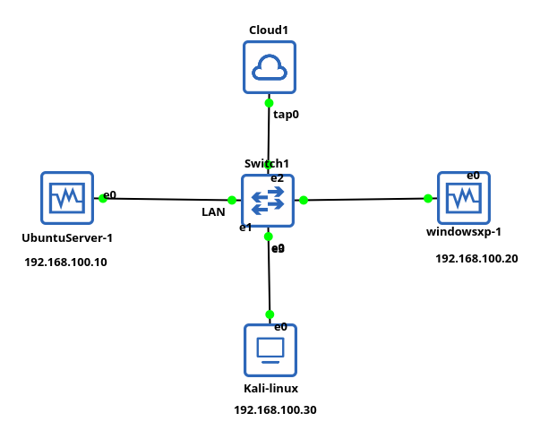

# Phase 1 — Infrastructure & Application vulnérable

## Objectif

Dans cette phase, j'ai mis en place un réseau d'entreprise local simulé sous GNS3
et VirtualBox, avec accès internet, puis j'y ai hébergé DVWA comme cible d'audit.

L'idée de départ est simple : avant de sécuriser un réseau, il faut savoir
l'attaquer. DVWA est une application web volontairement vulnérable — elle me
servira de cible tout au long de ce lab.

---

##  Architecture du réseau



> **Pourquoi tap0 et pas un bridge direct ?**
> Le WiFi (wlan0) ne supporte pas le mode bridge sous Linux. J'ai donc créé
> une interface virtuelle tap0 sur Kali hôte et configuré un NAT via iptables
> pour partager la connexion internet avec les VMs.

---

## 🖥️ Machines virtuelles

| Machine | OS | Version | Rôle | Adresse IP |
|---|---|---|---|---|
| Kali Linux (hôte) | Kali Linux | 2026.2 | Attaquant / Auditeur | 192.168.100.1 (tap0) |
| Ubuntu Server | Ubuntu Server | 24.04.1 LTS | Serveur web — héberge DVWA | 192.168.100.10 |
| Windows XP | Windows XP | 5.2.3790 | Client du réseau | 192.168.100.20 |

---

## 🛠️ Outils utilisés

| Outil | Version | Rôle |
|---|---|---|
| GNS3 | 3.0.6 | Simulation réseau — switch central |
| VirtualBox | 7.2.8 | Virtualisation des machines |
| tap0 | — | Interface virtuelle NAT sur Kali hôte |
| iptables | — | Partage de connexion WiFi vers les VMs |
| Apache2 | 2.4.58 | Serveur web pour DVWA |
| PHP | 8.3.6 | Langage serveur pour DVWA |
| MySQL | 8.0.46 | Base de données DVWA |
| DVWA | latest | Application web vulnérable |

---

## Étapes

### Étape 1 — Construire la topologie dans GNS3

La première chose à faire est de dessiner le réseau dans GNS3 avant de
toucher à quoi que ce soit d'autre. Ça donne une vision claire de ce qu'on
construit.

**Dans GNS3 :**
- Ajouter un **Switch** central
- Ajouter un **Cloud** et le configurer sur l'interface **tap0**
- Ajouter les 3 machines : UbuntuServer, WindowsXP, Kali (depuis VirtualBox)
- Relier chaque machine au Switch


> À ce stade les machines sont connectées mais elles n'ont pas encore
> d'adresses IP — elles ne peuvent pas communiquer entre elles.

---

### Étape 2 — Créer l'interface tap0 sur Kali hôte

Le Cloud dans GNS3 pointe sur tap0 — cette interface n'existe pas par défaut,
il faut la créer manuellement sur Kali hôte.

```bash
# Créer l'interface tap0
sudo ip tuntap add tap0 mode tap
sudo ip link set tap0 up
sudo ip addr add 192.168.100.1/24 dev tap0

# Activer le forwarding IP
# Sans ça, Kali reçoit les paquets des VMs mais ne les retransmet pas
sudo sysctl -w net.ipv4.ip_forward=1

# NAT — partager la connexion WiFi (wlan0) avec les VMs via tap0
sudo iptables -t nat -A POSTROUTING -o wlan0 -j MASQUERADE
sudo iptables -A FORWARD -i tap0 -o wlan0 -j ACCEPT
sudo iptables -A FORWARD -i wlan0 -o tap0 -m state \
  --state RELATED,ESTABLISHED -j ACCEPT
```


> **Note importante :** cette configuration est temporaire — elle disparaît
> au redémarrage de Kali. Pour la rendre permanente, il faudra la scripter
> ou l'intégrer au démarrage. Pour l'instant on la relance manuellement
> à chaque session de lab.

---

### Étape 3 — Configurer l'adresse IP sur Ubuntu Server

Une fois tap0 active et GNS3 lancé, on configure Ubuntu Server avec une
IP statique persistante via Netplan.

```bash
# Désactiver cloud-init pour qu'il n'écrase pas la config au redémarrage
sudo bash -c 'echo "network: {config: disabled}" > \
  /etc/cloud/cloud.cfg.d/99-disable-network.cfg'

# Créer le fichier de config Netplan
sudo nano /etc/netplan/99-static.yaml
```

Contenu du fichier :

```yaml
network:
  version: 2
  ethernets:
    enp0s3:
      dhcp4: false
      addresses:
        - 192.168.100.10/24
      routes:
        - to: default
          via: 192.168.100.1
      nameservers:
        addresses:
          - 8.8.8.8
          - 8.8.4.4
```

```bash
# Appliquer la configuration
sudo netplan apply
```


---

### Étape 4 — Vérifier la connectivité depuis Ubuntu Server

```bash
ping 192.168.100.1   # Ping vers Kali hôte
ping 8.8.8.8         # Ping vers internet
```


> Si le ping vers Kali passe mais pas vers internet, vérifier que
> le forwarding IP est bien actif sur Kali : `cat /proc/sys/net/ipv4/ip_forward`
> doit retourner 1.

---

### Étape 5 — Configurer l'adresse IP sur Windows XP

Sur Windows XP, la configuration se fait via l'interface graphique :

**Paramètres :**
- Adresse IP : `192.168.100.20`
- Masque de sous-réseau : `255.255.255.0`
- Passerelle par défaut : `192.168.100.1`


**Vérification :**

```cmd
ping 192.168.100.1    # Ping vers Kali hôte
ping 192.168.100.10   # Ping vers Ubuntu Server
```


---

### Étape 6 — Installer Apache, PHP et MySQL sur Ubuntu Server

Le réseau est en place. On installe maintenant la pile logicielle
nécessaire pour héberger DVWA.

```bash
sudo apt update && sudo apt upgrade -y
sudo apt install apache2 php php-mysqli php-gd libapache2-mod-php mysql-server -y
```

Vérifier qu'Apache tourne :

```bash
sudo systemctl status apache2
```

---

### Étape 7 — Installer DVWA

```bash
# Cloner DVWA dans le répertoire web Apache
cd /var/www/html
sudo git clone https://github.com/digininja/DVWA.git

# Configurer les permissions
sudo chown -R www-data:www-data /var/www/html/DVWA
sudo chmod -R 755 /var/www/html/DVWA

# Copier le fichier de configuration
cd /var/www/html/DVWA/config
sudo cp config.inc.php.dist config.inc.php
```


---

### Étape 8 — Créer la base de données MySQL

```bash
sudo mysql -u root
```

```sql
create database dvwa;
create user 'dvwa'@'localhost' identified by 'p@ssw0rd';
grant all privileges on dvwa.* to 'dvwa'@'localhost';
flush privileges;
exit;
```


---

### Étape 9 — Configurer DVWA

```bash
sudo nano /var/www/html/DVWA/config/config.inc.php
```

Modifier ces lignes :

```php
$_DVWA[ 'db_server' ]   = 'localhost';
$_DVWA[ 'db_database' ] = 'dvwa';
$_DVWA[ 'db_user' ]     = 'dvwa';
$_DVWA[ 'db_password' ] = 'p@ssw0rd';
```

> **Attention :** `db_server` doit rester `localhost` ou `127.0.0.1` — MySQL tourne
> localement sur Ubuntu Server. Ne pas mettre l'IP du serveur ici.

```bash
sudo systemctl restart apache2
```


---

### Étape 10 — Initialiser et accéder à DVWA

Depuis le navigateur sur Kali hôte :

```
http://192.168.100.10/DVWA/login.php
```

- Login : `admin`
- Password : `password`

Cliquer sur **Setup / Reset DB** puis **Create / Reset Database**.


> DVWA est accessible depuis toutes les machines du réseau local
> via `http://192.168.100.10/DVWA/index.php`

---

## Résultats

- [x] Topologie GNS3 construite et opérationnelle
- [x] Interface tap0 créée et NAT configuré sur Kali hôte
- [x] Ubuntu Server configuré avec IP statique persistante
- [x] Ping Ubuntu Server → Kali hôte fonctionnel
- [x] Ping Ubuntu Server → Internet fonctionnel
- [x] Windows XP configuré et connecté au réseau
- [x] DVWA installé et accessible depuis toutes les machines

---

## 🔗 Phase suivante

[Phase 2 — Capture et analyse du trafic réseau](../Phase%202%20-%20Capture%20et%20analyse%20du%20trafic%20réseau/README.md)
```
