# Phase 1 — Infrastructure & Application vulnérable

## Objectif

Mettre en place un réseau d'entreprise local simulé avec accès internet,
et y héberger DVWA (Damn Vulnerable Web Application) comme cible d'audit.

---

##  Architecture

## 🖥️ Machines virtuelles

| Machine | OS | Version | Rôle | Adresse IP |
|---|---|---|---|---|
| Kali Linux (hôte) | Kali Linux | 2026.2 | Attaquant / Auditeur | 192.168.100.1 (tap0) |
| Ubuntu Server | Ubuntu Server | 24.04.1 LTS | Serveur web — héberge DVWA | 192.168.100.10 |
| Windows XP | Windows XP | 5.2.3790 | Client du réseau | 192.168.100.20 |

---

## 🛠️ Outils utilisés

| Outil | Version | Rôle |
|---|---|---|
| GNS3 | 3.0.6 | Simulation réseau — switch central |
| VirtualBox | 7.2.8 | Virtualisation des machines |
| tap0 | — | Interface virtuelle NAT sur Kali hôte |
| iptables | — | Partage de connexion WiFi vers les VMs |
| Apache2 | 2.4.58 | Serveur web pour DVWA |
| PHP | 8.3.6 | Langage serveur pour DVWA |
| MySQL | 8.0.46 | Base de données DVWA |
| DVWA | latest | Application web vulnérable |

---

## 📋 Étapes réalisées

### Étape 1 — Configuration NAT sur Kali hôte

Le WiFi (wlan0) ne supporte pas le bridge direct sous Linux.
Solution : création d'une interface tap0 avec partage de connexion via iptables.

```bash
# Créer l'interface tap0
sudo ip tuntap add tap0 mode tap
sudo ip link set tap0 up
sudo ip addr add 192.168.100.1/24 dev tap0

# Activer le forwarding IP
sudo sysctl -w net.ipv4.ip_forward=1

# NAT — partager wlan0 via tap0
sudo iptables -t nat -A POSTROUTING -o wlan0 -j MASQUERADE
sudo iptables -A FORWARD -i tap0 -o wlan0 -j ACCEPT
sudo iptables -A FORWARD -i wlan0 -o tap0 -m state \
  --state RELATED,ESTABLISHED -j ACCEPT
```
### Capture d'écran sur kali :

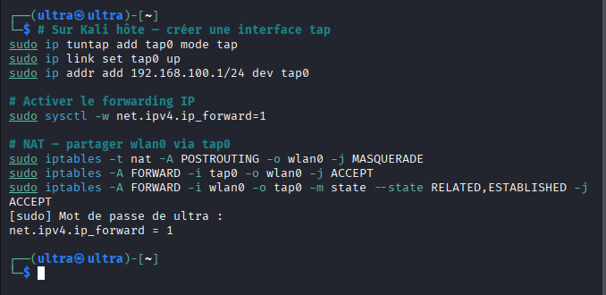

---

### Étape 2 — Configuration réseau sur Ubuntu Server

```bash
# Assigner une IP statique
sudo ip addr add 192.168.100.10/24 dev enp0s3
sudo ip link set enp0s3 up

# Ajouter la route par défaut
sudo ip route add default via 192.168.100.1

# Configurer le DNS
echo "nameserver 8.8.8.8" | sudo tee /etc/resolv.conf
```
### Capture d'écran sur Ubuntu Server :

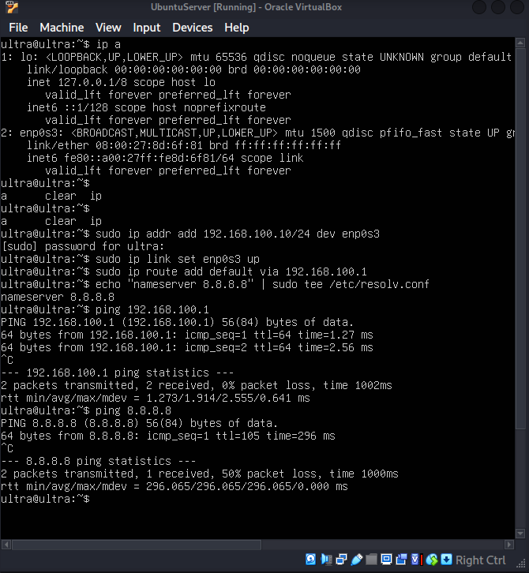

---

### Étape 3 — Vérification de la connectivité

```bash
# Depuis Ubuntu Server
ping 192.168.100.1   # Ping vers Kali hôte
ping 8.8.8.8         # Ping vers internet
```
### Capture d'écran sur Ubuntu server

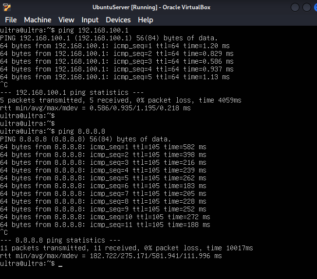

---

### Étape 4 — Topologie GNS3
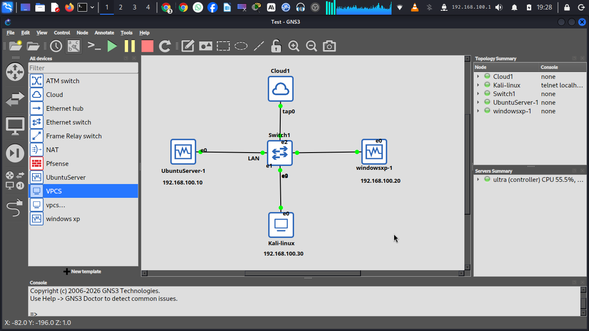

---

### Étape 5 — Configuration réseau Windows XP

Attribution d'une IP statique via l'interface graphique Windows XP.

**Paramètres configurés :**
- Adresse IP : 192.168.100.20
- Masque de sous-réseau : 255.255.255.0
- Passerelle par défaut : 192.168.100.1

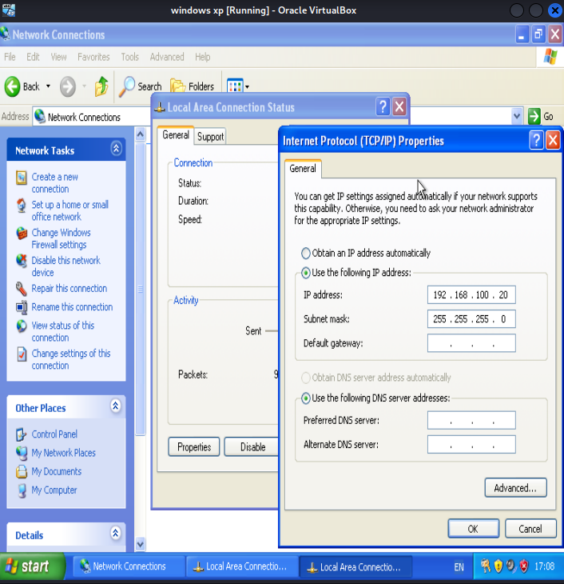

**Vérification de la connectivité :**

```cmd
ping 192.168.100.1    # Ping vers Kali hôte 
ping 192.168.100.10   # Ping vers Ubuntu Server 
```

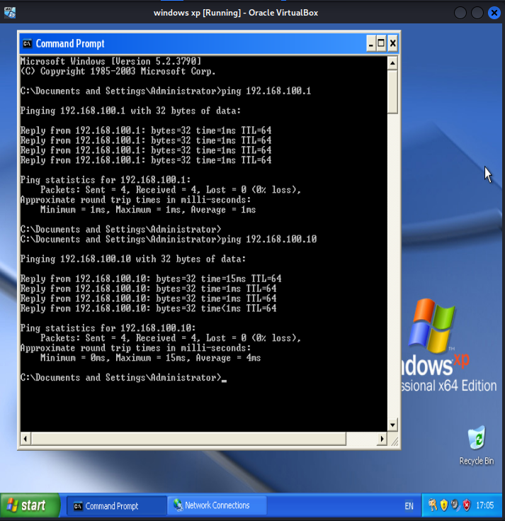

### Étape 6 — Installation de DVWA

```bash
# Cloner DVWA dans le répertoire web Apache
cd /var/www/html
sudo git clone https://github.com/digininja/DVWA.git

# Configurer les permissions
sudo chown -R www-data:www-data /var/www/html/DVWA
sudo chmod -R 755 /var/www/html/DVWA

# Copier le fichier de configuration
cd /var/www/html/DVWA/config
sudo cp config.inc.php.dist config.inc.php
```

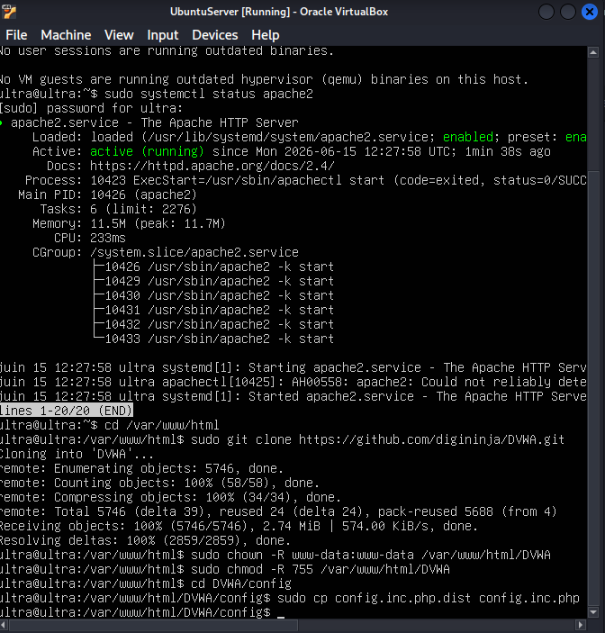

---

### Étape 7 — Configuration de la base de données MySQL

```bash
sudo mysql -u root
```

```sql
create database dvwa;
create user 'dvwa'@'localhost' identified by 'p@ssw0rd';
grant all privileges on dvwa.* to 'dvwa'@'localhost';
flush privileges;
exit;
```

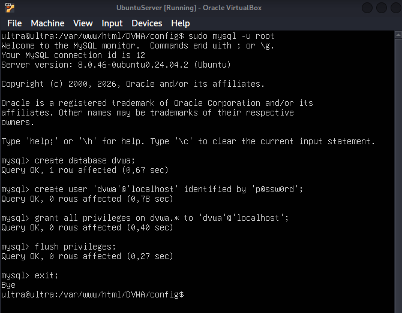

---

### Étape 8 — Configuration du fichier config.inc.php

```bash
sudo nano /var/www/html/DVWA/config/config.inc.php
```

Paramètres configurés :

```php
$_DVWA[ 'db_server' ]   = '127.0.0.1';
$_DVWA[ 'db_database' ] = 'dvwa';
$_DVWA[ 'db_user' ]     = 'dvwa';
$_DVWA[ 'db_password' ] = 'p@ssw0rd';
```

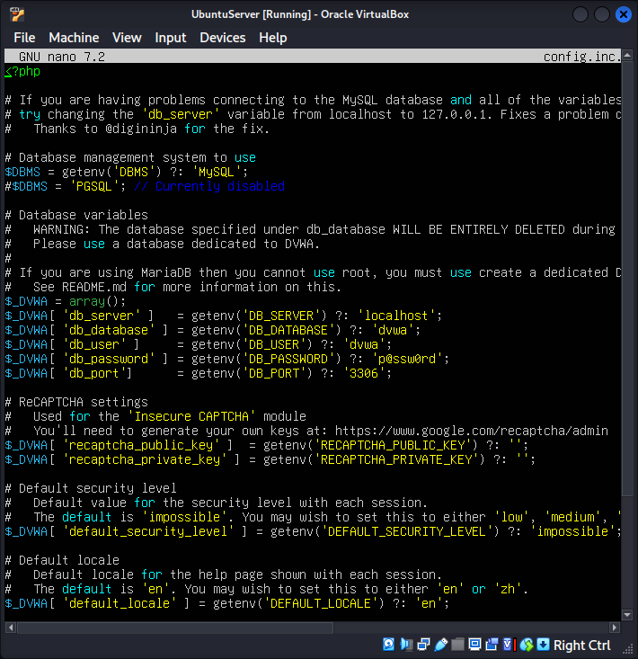

---

### Étape 9 — Accès à DVWA depuis le réseau

**Depuis Kali hôte — page de connexion :**

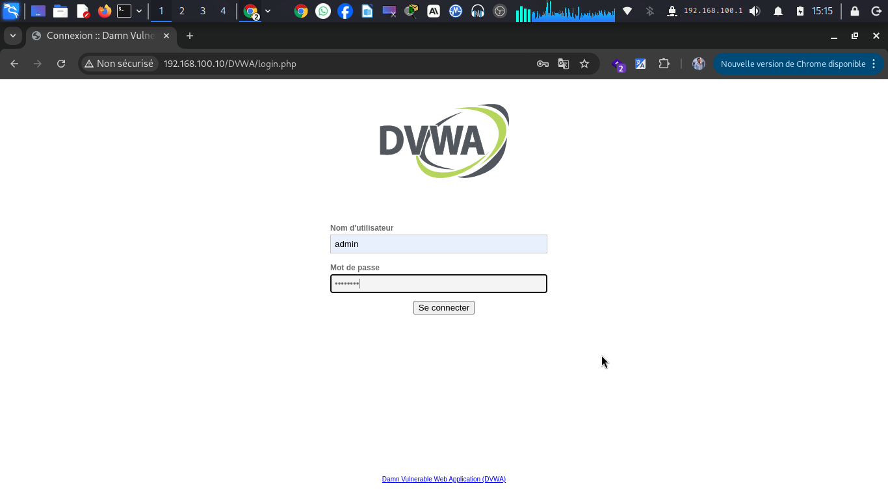

**Depuis Kali hôte — tableau de bord DVWA :**

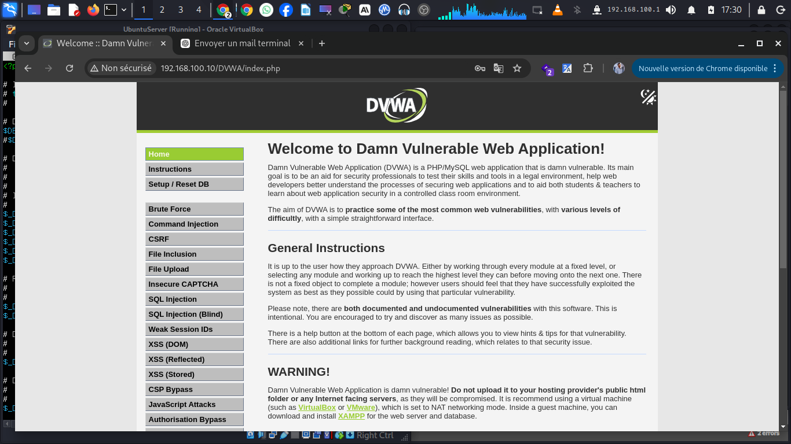

**Depuis Windows XP — accès confirmé :**

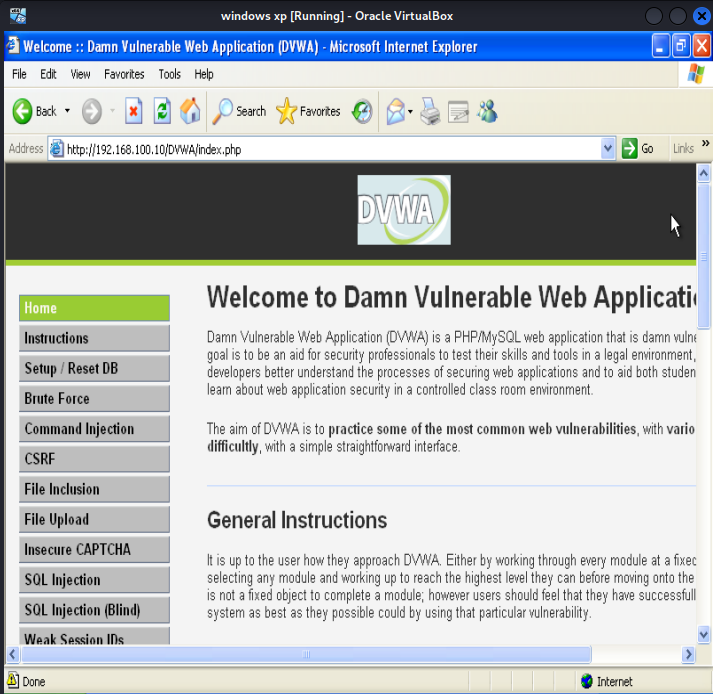

> DVWA est accessible depuis toutes les machines du réseau local
> via `http://192.168.100.10/DVWA/index.php`

## Résultats

- [x] Interface tap0 créée sur Kali hôte
- [x] NAT configuré — partage WiFi vers les VMs
- [x] Topologie GNS3 opérationnelle
- [x] Ping Ubuntu Server → Kali hôte fonctionnel
- [x] Ping Ubuntu Server → Internet fonctionnel
- [x] Configuration réseau Windows XP vérifiée
- [x] DVWA installé et accessible

---


## 🔗 Phase suivante

[Phase 2 — Capture et analyse du trafic réseau](../Phase%202%20-%20Capture%20et%20analyse%20du%20trafic%20réseau/README.md)
